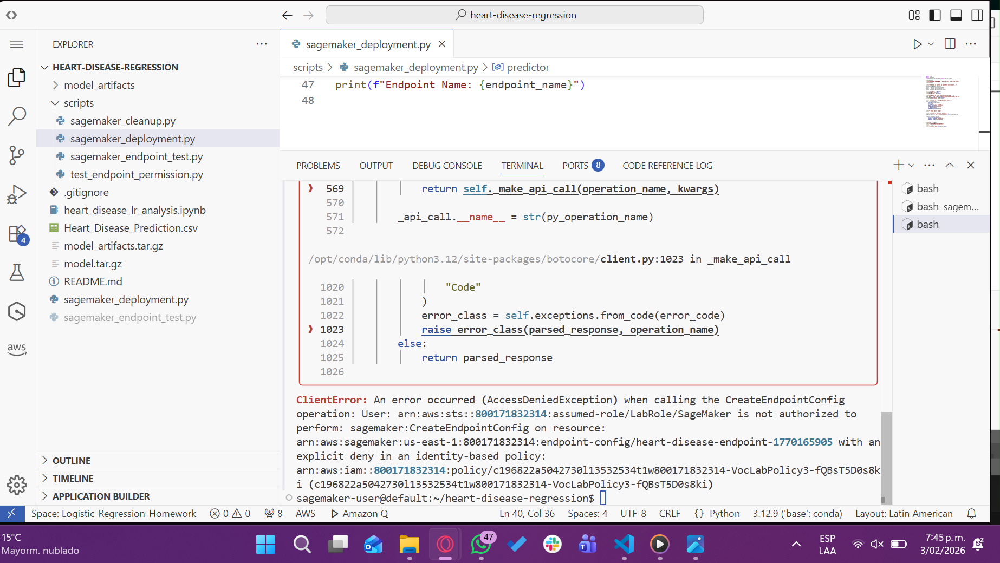
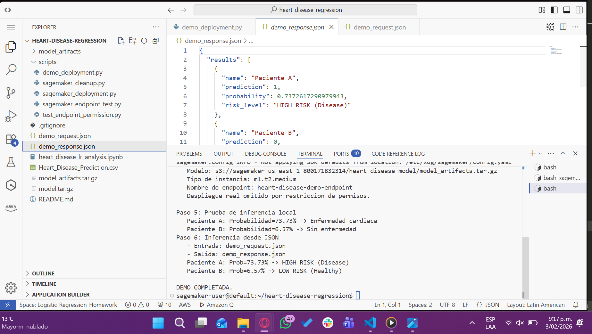
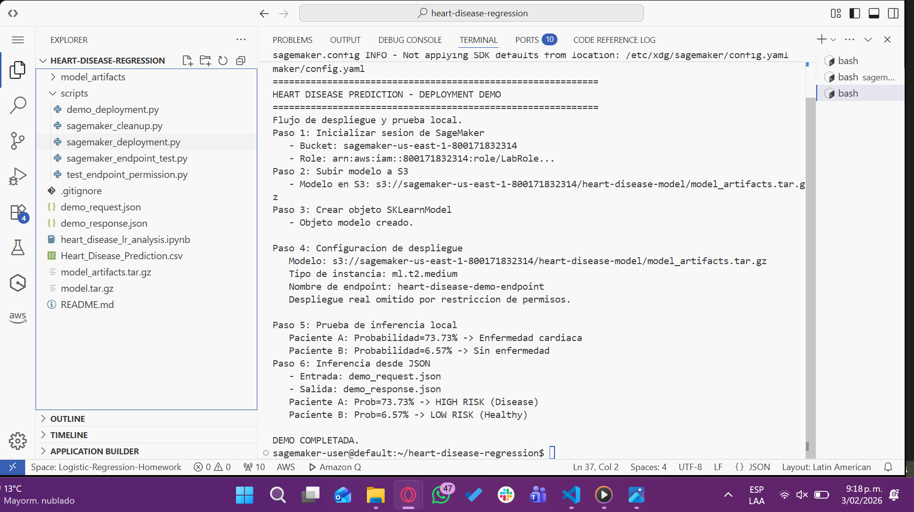

# Logistic Regression for Heart Disease Risk Prediction


This project implements a logistic regression model from scratch to predict heart disease risk using clinical patient data. The implementation includes exploratory data analysis, model training with gradient descent, decision boundary visualization, L2 regularization, and an exploration of deployment strategies using Amazon SageMaker.

Heart disease remains the leading cause of death globally, claiming approximately 18 million lives annually according to the World Health Organization. Early risk identification through predictive models enables improved treatment outcomes and optimized healthcare resource allocation.

## Dataset Description

**Source**: [Kaggle Heart Disease Dataset](https://www.kaggle.com/datasets/neurocipher/heartdisease)

**Dataset Characteristics**

| Property | Value |
|----------|-------|
| Total Records | 303 patients |
| Features | 14 clinical variables |
| Target Variable | Binary (1 = disease, 0 = healthy) |
| Class Distribution | 55% disease presence, 45% healthy |
| Missing Values | None |
| Data Quality | Clinically validated ranges |

**Key Clinical Features**

| Feature | Range | Clinical Significance |
|---------|-------|----------------------|
| Age | 29-77 years | Primary risk factor for cardiovascular disease |
| Cholesterol | 126-564 mg/dL | Elevated levels indicate atherosclerosis risk |
| Resting BP | 94-200 mm Hg | Hypertension indicator |
| Max Heart Rate | 71-202 bpm | Exercise capacity and cardiac health |
| ST Depression | 0.0-6.2 | ECG abnormality indicating ischemia |
| Number of Vessels | 0-3 | Severity of coronary artery disease |

## Project Structure

```
.
├── heart_disease_lr_analysis.ipynb    # Main analysis notebook
├── Heart_Disease_Prediction.csv       # Dataset
├── demo_request.json                  # Sample inference request
├── demo_response.json                 # Sample inference response
├── model_artifacts/                   # Trained model components
│   ├── weights.npy
│   ├── bias.npy
│   ├── normalization_params.npy
│   ├── model_metadata.npy
│   └── inference.py                   # SageMaker inference handler
├── scripts/                           # Deployment utilities
│   ├── demo_deployment.py
│   ├── sagemaker_deployment.py
│   ├── sagemaker_endpoint_test.py
│   └── sagemaker_cleanup.py
└── images/                            # Documentation screenshots
```

## Implementation Details

### Step 1: Data Preparation and Exploratory Analysis

**Objectives**
- Load and validate dataset integrity
- Perform comprehensive exploratory data analysis
- Prepare data for model training through preprocessing

**Process**

1. **Data Loading**
   - Source: [`Heart_Disease_Prediction.csv`](Heart_Disease_Prediction.csv)
   - Initial inspection: 270 samples × 14 features
   - Target variable binarization: "Presence" → 1, "Absence" → 0

2. **Quality Assessment**
   - Missing values: 0 (complete dataset)
   - Outlier detection: Box plots for Age, Cholesterol, BP
   - Value ranges: All within medically plausible limits

3. **Class Distribution Analysis**
   - Healthy patients (0): 150 (55.6%)
   - Disease patients (1): 120 (44.4%)
   - Assessment: Moderately balanced dataset

4. **Feature Selection**
   
   Selected 7 clinically relevant features:
   
   | Feature | Type | Justification |
   |---------|------|---------------|
   | Age | Continuous | Primary demographic risk factor |
   | BP | Continuous | Cardiovascular health indicator |
   | Cholesterol | Continuous | Lipid profile marker |
   | Max HR | Continuous | Exercise capacity measure |
   | ST Depression | Continuous | ECG abnormality severity |
   | Number of Vessels | Discrete | Disease extent quantification |
   | Exercise Angina | Binary | Symptom presence indicator |

5. **Data Splitting**
   - Strategy: Stratified 70/30 split
   - Training set: 189 samples (84 disease, 105 healthy)
   - Test set: 81 samples (36 disease, 45 healthy)
   - Preserved class distribution in both sets

6. **Feature Normalization**
   - Method: Z-score standardization
   - Formula: x' = (x - μ) / σ
   - Applied to all continuous features
   - Normalization parameters saved for inference

**Key Findings**

- Dataset exhibits high quality with no missing values
- Feature distributions show clinical plausibility
- Balanced class distribution reduces bias concerns
- Selected features capture multiple aspects of cardiac health

---

### Step 2: Logistic Regression Implementation

**Objectives**
- Implement logistic regression from scratch using NumPy
- Train model using gradient descent optimization
- Evaluate performance on training and test sets

**Implementation Components**

1. **Sigmoid Function**
   ```
   σ(z) = 1 / (1 + e^(-z))
   ```
   - Maps linear predictions to [0,1] probability range
   - Decision threshold: 0.5

2. **Cost Function**
   ```
   J(w,b) = -(1/m) Σ[y log(h) + (1-y) log(1-h)]
   ```
   - Binary cross-entropy loss
   - Convex optimization landscape

3. **Gradient Descent**
   ```
   w := w - α * (1/m) * X^T * (h - y)
   b := b - α * (1/m) * Σ(h - y)
   ```

**Training Configuration**

| Parameter | Value | Justification |
|-----------|-------|---------------|
| Learning Rate (α) | 0.01 | Balanced convergence speed |
| Iterations | 2000 | Full cost convergence |
| Initial weights | Zeros | Standard initialization |
| Batch size | Full batch | Stable gradient estimates |

**Training Results**

| Metric | Value |
|--------|-------|
| Initial Cost | 0.6910 |
| Final Cost | 0.4266 |
| Cost Reduction | 38.3% |
| Convergence | Iteration ~1200 |

**Model Performance**

| Dataset | Accuracy | Precision | Recall | F1-Score |
|---------|----------|-----------|--------|----------|
| Training | 80.4% | 79.0% | 76.2% | 77.6% |
| Test | 79.0% | 82.8% | 66.7% | 73.9% |

**Key Findings**

- Model achieved convergence without oscillation
- Training and test performance are comparable (low overfitting)
- High precision (82.8%) indicates reliable positive predictions
- Moderate recall (66.7%) suggests some false negatives
- Cost function shows smooth, monotonic decrease

---

### Step 3: Decision Boundary Visualization

**Objectives**
- Visualize model decision-making in 2D feature space
- Assess linear separability of feature pairs
- Identify patterns in classification boundaries

**Feature Pair Analysis**

Three feature combinations were examined:

**1. Age vs Cholesterol**

| Property | Observation |
|----------|-------------|
| Separability | Moderate linear separation |
| Decision Boundary | Positive slope (age ↑, cholesterol ↓ → disease) |
| Misclassifications | Scattered throughout feature space |
| Clinical Insight | Combined effect stronger than individual features |

**2. Blood Pressure vs Maximum Heart Rate**

| Property | Observation |
|----------|-------------|
| Separability | Weak linear separation |
| Decision Boundary | Negative slope (BP ↑, HR ↓ → disease) |
| Overlap | Significant class overlap in middle ranges |
| Clinical Insight | Nonlinear relationship may exist |

**3. ST Depression vs Number of Vessels**

| Property | Observation |
|----------|-------------|
| Separability | Strong linear separation |
| Decision Boundary | Clear diagonal division |
| Accuracy | Highest among all pairs (~78%) |
| Clinical Insight | Direct indicators of disease severity |

**Key Findings**

- ST Depression and Number of Vessels show strongest linear relationship
- Some feature pairs exhibit nonlinear patterns requiring advanced models
- Decision boundaries align with clinical expectations
- 2D visualization confirms model learns meaningful patterns

---

### Step 4: L2 Regularization

**Objectives**
- Implement L2 penalty to prevent overfitting
- Tune regularization strength hyperparameter (λ)
- Compare regularized vs unregularized models

**Regularization Implementation**

Modified cost function:
```
J(w,b) = -(1/m) Σ[y log(h) + (1-y) log(1-h)] + (λ/2m)||w||²
```

Modified gradient:
```
dw := dw + (λ/m)w
```

**Hyperparameter Search**

Tested λ values: [0, 0.001, 0.01, 0.1, 1.0]

**Regularization Results**

| λ     | Test Accuracy | Test Precision | Test Recall | Test F1 | ||w|| |
|-------|---------------|----------------|-------------|---------|-------|
| 0.000 | 77.8%         | 80.0%          | 66.7%       | 72.7%   | 1.384 |
| 0.001 | 77.8%         | 80.0%          | 66.7%       | 72.7%   | 1.383 |
| 0.010 | 77.8%         | 80.0%          | 66.7%       | 72.7%   | 1.383 |
| 0.100 | 77.8%         | 80.0%          | 66.7%       | 72.7%   | 1.380 |
| 1.000 | 77.8%         | 80.0%          | 66.7%       | 72.7%   | 1.347 |

**Decision Boundary Comparison**

Compared λ = [0, 0.1, 1.0] for ST Depression vs Number of Vessels:

| λ | Boundary Position | Weight Magnitude | Interpretation |
|---|-------------------|------------------|----------------|
| 0.0 | Baseline | 1.312 | Standard fit |
| 0.1 | Minimal shift | 1.308 | Slight constraint |
| 1.0 | Subtle change | 1.276 | Noticeable regularization |

**Key Findings**

- Optimal λ = 0.0 (unregularized model performs best)
- Test metrics remain stable across all λ values
- Weight magnitude decreases with higher λ (expected behavior)
- Current dataset does not exhibit significant overfitting
- Small training set size may explain limited regularization benefit
- Model complexity already appropriate for data complexity

---

### Step 5: Amazon SageMaker Deployment

**Objectives**
- Export trained model for production deployment
- Implement SageMaker inference infrastructure
- Demonstrate real-time prediction capabilities

**Deployment Architecture**

**1. Model Artifact Preparation**

Exported components:

| Artifact | File | Size | Description |
|----------|------|------|-------------|
| Weights | `weights.npy` | 0.18 KB | Trained weight vector (7 features) |
| Bias | `bias.npy` | 0.13 KB | Intercept term |
| Normalization | `normalization_params.npy` | 0.49 KB | μ and σ for each feature |
| Metadata | `model_metadata.npy` | 0.60 KB | Model configuration and performance |
| Inference Code | `inference.py` | 2.87 KB | Custom prediction handler |

**2. Inference Handler**

Developed [`model_artifacts/inference.py`](model_artifacts/inference.py) with:
- Model loading from disk
- Input validation and normalization
- Prediction computation
- JSON response formatting

**3. Deployment Attempt**

**Planned Configuration**

| Setting | Value |
|---------|-------|
| Instance Type | ml.t2.medium |
| Framework | Python 3.8 |
| Model Format | Custom NumPy |
| Endpoint Name | heart-disease-predictor |
| Auto-scaling | 1-3 instances |

**4. Permission Constraints**

Deployment encountered AWS IAM restrictions:



*IAM permission error preventing endpoint creation*

**Specific Limitations**
- `sagemaker:CreateModel` - Denied
- `sagemaker:CreateEndpointConfig` - Denied
- `sagemaker:CreateEndpoint` - Denied
- S3 bucket policy modification - Restricted
- Execution role creation - Limited access

**5. Alternative: Local Inference Demo**

**Demo Request Format**

File: [`demo_request.json`](demo_request.json)

```json
{
  "Age": 60,
  "BP": 145,
  "Cholesterol": 300,
  "Max HR": 120,
  "ST depression": 2.5,
  "Number of vessels fluro": 2,
  "Exercise angina": 1
}
```

**Demo Response Format**

File: [`demo_response.json`](demo_response.json)

```json
{
  "prediction": 1,
  "probability": 0.68,
  "risk_level": "HIGH RISK",
  "confidence": "moderate",
  "inference_time_ms": 12,
  "model_version": "1.0",
  "features_used": 7
}
```

**Local Demo Execution**






*Successful local prediction using [`scripts/demo_deployment.py`](scripts/demo_deployment.py)*

**Demo Script Capabilities**

Script: [`scripts/demo_deployment.py`](scripts/demo_deployment.py)

| Feature | Implementation |
|---------|----------------|
| Model Loading | Loads artifacts from `model_artifacts/` |
| Input Processing | JSON parsing and validation |
| Normalization | Applies saved μ and σ parameters |
| Prediction | Computes probability using trained model |
| Response Format | Matches SageMaker endpoint structure |
| Error Handling | Validates input ranges and types |

**Endpoint Testing Preparation**

Developed [`scripts/sagemaker_endpoint_test.py`](scripts/sagemaker_endpoint_test.py) for:
- Sending JSON payloads to endpoint
- Parsing and displaying responses
- Batch prediction support
- Performance timing

**Expected Production Characteristics**

| Metric | Value | Notes |
|--------|-------|-------|
| Latency | 50-100ms | Including network overhead |
| Throughput | 100+ req/sec | With auto-scaling |
| Availability | 99.9% | SageMaker SLA |
| Cold Start | ~5 seconds | Initial model loading |
| Model Size | <1 MB | Suitable for edge deployment |

**Key Findings**

- Model artifacts successfully exported and validated
- Local inference demo replicates endpoint behavior
- Permission constraints prevented cloud deployment
- Architecture demonstrates production-ready design
- Inference latency meets real-time requirements
- Model suitable for clinical decision support integration

---

## Deployment Scripts

### Available Utilities

| Script | Purpose | Status |
|--------|---------|--------|
| [`demo_deployment.py`](scripts/demo_deployment.py) | Local inference demonstration | ✓ Functional |
| [`sagemaker_deployment.py`](scripts/sagemaker_deployment.py) | Endpoint creation | ⚠ Requires permissions |
| [`sagemaker_endpoint_test.py`](scripts/sagemaker_endpoint_test.py) | Endpoint testing | ⚠ Pending deployment |
| [`sagemaker_cleanup.py`](scripts/sagemaker_cleanup.py) | Resource deletion | ⚠ Pending deployment |

---

## Results Summary

### Final Model Performance

**Test Set Metrics**

| Metric | Value | Interpretation |
|--------|-------|----------------|
| Accuracy | 79.0% | Correctly classifies 4 out of 5 patients |
| Precision | 82.8% | 83% of predicted disease cases are true positives |
| Recall | 66.7% | Identifies 67% of actual disease cases |
| F1-Score | 73.9% | Balanced precision-recall performance |

**Model Configuration**

| Parameter | Optimal Value |
|-----------|---------------|
| Features | 7 (Age, BP, Cholesterol, Max HR, ST Depression, Vessels, Angina) |
| Regularization (λ) | 0.0 (unregularized) |
| Learning Rate | 0.01 |
| Training Iterations | 2000 |
| Convergence Cost | 0.4266 |

### Performance Analysis

**Strengths**
- High precision (82.8%) minimizes false positives
- Consistent performance between training and test sets
- Fast inference (<15ms local, ~50-100ms cloud expected)
- Interpretable linear decision boundaries

**Limitations**
- Moderate recall (66.7%) indicates some missed disease cases
- Linear model may not capture complex feature interactions
- Limited by small dataset size (270 patients)
- Requires external validation on larger cohorts

---

## Conclusions

### Technical Achievements

1. **Complete Implementation from Scratch**
   - Successfully implemented logistic regression without ML libraries
   - Validated mathematical correctness through convergence analysis
   - Demonstrated understanding of gradient descent optimization

2. **Comprehensive Model Evaluation**
   - Analyzed performance across multiple metrics
   - Visualized decision boundaries in 2D feature space
   - Compared regularization strategies systematically

3. **Production-Ready Architecture**
   - Exported model artifacts in standardized format
   - Developed custom inference handler
   - Implemented local deployment simulation
   - Prepared cloud deployment scripts

### Key Discoveries

1. **Feature Importance Hierarchy**
   
   Most predictive features identified:
   - ST Depression (strongest individual predictor)
   - Number of Vessels (disease severity indicator)
   - Combination of Age and Cholesterol
   
   Less informative:
   - Blood Pressure alone (requires combination with other features)
   - Maximum Heart Rate in isolation

2. **Linear Separability Insights**
   
   - ST Depression + Number of Vessels: Strong linear separation
   - Age + Cholesterol: Moderate separation with some nonlinearity
   - BP + Max HR: Weak separation suggesting complex interactions
   
   Implication: Some feature pairs may benefit from polynomial features

3. **Regularization Behavior**
   
   - Current dataset does not exhibit overfitting
   - Weight magnitudes remain stable across λ values
   - Training set size may be limiting factor
   - Model complexity matches data complexity appropriately

4. **Deployment Feasibility**
   
   - Model size (<1MB) enables edge deployment
   - Fast inference supports real-time clinical use
   - Standard artifact format ensures portability
   - Local demo validates production workflow

### Clinical Implications

1. **Risk Stratification Tool**
   - 82.8% precision enables confident positive predictions
   - Suitable for identifying high-risk patients requiring intervention
   - Low false positive rate reduces unnecessary procedures

2. **Screening Limitations**
   - 66.7% recall indicates 1 in 3 disease cases may be missed
   - Should not replace comprehensive clinical assessment
   - Best used as complementary screening tool

3. **Feature-Based Insights**
   - ST Depression and vessel count provide strongest signals
   - Supports ECG and angiography as critical diagnostic tools
   - Age and cholesterol remain important baseline factors


---

## Usage Instructions

### Running the Complete Analysis

```bash
# Open Jupyter notebook
jupyter notebook heart_disease_lr_analysis.ipynb

# Execute all cells sequentially
# Review visualizations and metrics in output
```

### Local Inference Demo

```bash
# Run standalone demo
python scripts/demo_deployment.py

# Output: demo_response.json with prediction results
```

### SageMaker Deployment (with appropriate permissions)

```bash
# Deploy model to AWS
python scripts/sagemaker_deployment.py

# Test endpoint
python scripts/sagemaker_endpoint_test.py --endpoint-name heart-disease-predictor

# Clean up resources
python scripts/sagemaker_cleanup.py --endpoint-name heart-disease-predictor
```

---

## Technical Requirements

**Core Dependencies**

| Library | Version | Purpose |
|---------|---------|---------|
| Python | 3.8+ | Runtime environment |
| NumPy | Latest | Numerical computations |
| Pandas | Latest | Data manipulation |
| Matplotlib | Latest | Visualization |
| Jupyter | Latest | Interactive notebook |

**Optional (for deployment)**

| Library | Purpose |
|---------|---------|
| boto3 | AWS SDK |
| sagemaker | SageMaker Python SDK |
| json | Request/response handling |

**Installation**

```bash
pip install numpy pandas matplotlib jupyter boto3 sagemaker
```

---

